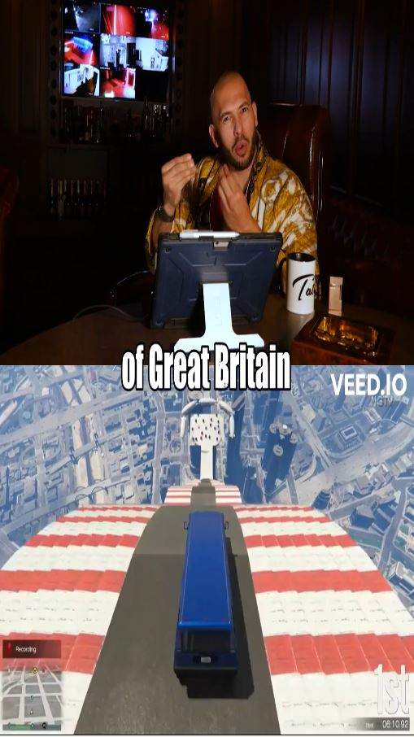
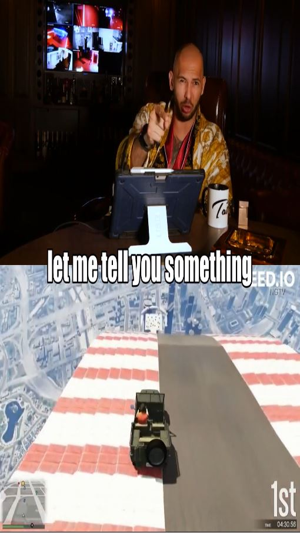

# Streamlining Andrew Tate Shorts

Shorts are videos that range between 15-60 seconds, and have an aspect ratio that is optimized for mobile phone usage (9:16).
Andrew Tate Shorts in partciular have several add on features, such as half of the screen being a dynamic video-game object. This is to ensure the audience's short attention span. Additionally, there is the inclusion of subtitles, background music, and sound effects (SFX).



## Installation

- Install pip and python3 on your machine
- Run 'chmod +x ./dependencies.sh'
- Run './dependencies.sh'


## Usage/Examples
Unfortunately, Andrew Tate is a cancelled figure, so his content is unaccessible through regular means (YouTube). There is, however, an archive of all of his old content (TateSpeech) on odysee.com
- Find Youtube links for background video-game visual, background music, SFX. Edit the URL arrays within tateshorts.py & backgroundSFX.py accordingly...
```python
# tateshorts.py
URLs = ['https://youtu.be/9NgBLirYQS8','https://www.youtube.com/watch?v=DHWcFozSFso','https://youtu.be/DTp8Ul82nYc']

# backgroundSFX.py
backgroundMusic = ['https://youtu.be/phBThlPTBEg','https://youtu.be/W4VTq0sa9yg']
SFX = ['https://www.youtube.com/watch?v=gfajflxbHUo','https://www.youtube.com/watch?v=2WWGVDR-7oM','https://www.youtube.com/watch?v=H9CWQaMYXiI','https://www.youtube.com/watch?v=4PTY8jNeOas','https://www.youtube.com/watch?v=VXwBY_dv2Qo']
```
- Run 'GOOGLE_APPLICATION_CREDENTIALS=./YOUR_GOOGLE_API_KEY.json ./tateshorts.py' and enter the Odysee URL as CLI
- Select the start and end timestamps that you want to clip/trim from within the original video (HH:MM:SS or MM:SS)
- Afterwards, check tateSubtitles.srt to make sure Google's speech-to-text performed an accurate transcript
- Run './generateVideo.py'
- Run './backgroundSFX.py and select what music & SFX you want at any correspondent timestamp'

    
## Environment Variables

- To run this project, you will need to download a JSON API key from Google Speech To Text. This is trivial to do, as Google provides you with a free trial for a long time.

